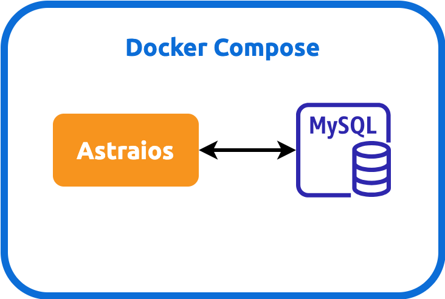

Running Astraios in Docker Compose
----------------------------------

### Defining Data Models

Astraios can run in [Docker Compose] for the following purposes

1. Decoupling frontend and backend development
2. Easily integrating Astraios-backed application testing in CI/CD



```bash
cd astraios
mvn clean package
MODEL_PACKAGE_NAME=$ASTRAIOS_MODEL_PACKAGE_NAME docker compose up --build --force-recreate
```

where `$ASTRAIOS_MODEL_PACKAGE_NAME` is the package in config JAR that contains all
[elide models](https://elide.io/pages/guide/v7/02-data-model.html). It can be set, for example, at command line with:

```bash
export ASTRAIOS_MODEL_PACKAGE_NAME=com.mycompany.astraios.models
```

The variable will be [passed](https://stackoverflow.com/a/58900415) into Docker Compose file.

### Troubleshooting

#### Database Does Not Contain Model Packages's Bean Table

_If tests is running in IDE_, make sure the model package JAR it is in IDE's **External Libraries**

Running Tests
-------------

```bash
mvn clean verify
```

For IT tests, we use [Testcontainers] instead of [jcabi-mysql] because the latter is hard to configure and debug and
[Testcontainers] support more types of db, such as mongo

Packaging
---------

```bash
mvn clean package
```

A [**WAR** file](https://en.wikipedia.org/wiki/WAR_(file_format)) named `astraios-1.0-SNAPSHOT.war` will
be generated under _target_ directory for [running in Jetty](#running-in-standalone-jetty)

Running Webservice in Standalone Jetty (Production)
---------------------------------------------------

### Download Jetty

At [download page](https://www.eclipse.org/jetty/download.php), pick up a `.tgz` distribution. **It is very important
to pick up Jetty server version that matches JDK version**. For JDK **17**, it's been tested that Jetty _11.0.15_ works

:::note

During testing, the embedded Jetty version is also 11.0.15

:::

Hence, we will use "11.0.15" release as an example:


Put the `tar.gz` file into a location of your choice as the installation path and extract the Jetty binary using

```bash
tar -xzvf jetty-home-11.0.15.tar.gz
```

The extracted directory *jetty-home-11.0.15* is the Jetty distribution. We call this directory **$JETTY_HOME**, which
should not be modified.

### Setting Up Standalone Jetty

Our [WAR file](#packaging) will be dropped to a directory where Jetty can pick up and run. We call this directory
**$JETTY_BASE**, which is usually different from the _$JETTY_HOME_. The _$JETTY_BASE_ also contains container runtime
configs. In short, the Standalone Jetty container will be setup with

```bash
export JETTY_HOME=/path/to/jetty-home-11.0.15
mkdir -p /path/to/jetty-base
cd /path/to/jetty-base
java -jar $JETTY_HOME/start.jar --add-module=annotations,server,http,deploy,servlet,webapp,resources,jsp,websocket
```

where `/path/to/` is the _absolute_ path to the directory containing the `jetty-home-11.0.15` directory

The `--add-module=annotations,server,http,deploy` is how we configure the Jetty container.

Lastly, drop the [WAR file](#packaging) into **/path/to/jetty-base/webapps** directory and rename the WAR file to
**ROOT.war**:

```bash
mv /path/to/war-file /path/to/jetty-base/webapps/ROOT.war
```

### Configuring Astraios

#### Define Model Package

#### Set Application Properties

### Running Astraios

```bash
java -jar $JETTY_HOME/start.jar
```

The webservice will run on port **8080**, and you will see the data you inserted

[astraios]: https://github.com/paion-data/astraios

[Docker Compose]: https://docs.docker.com/compose/

[jcabi-mysql]: https://mysql.jcabi.com/

[Testcontainers]: https://qubitpi.github.io/testcontainers-java/
