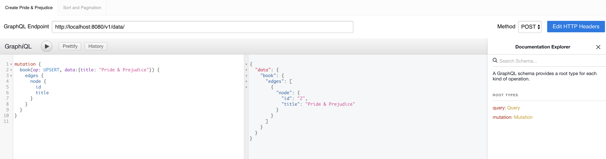

The following guide is intended to help developers who maintain or want to make changes to the Astraios.

Building
--------

Astraios is built using [Maven](https://maven.apache.org/). To fully build and package the project at least once, run

```bash
mvn clean package
```

Running Tests
-------------

The IT tests will run against an [example model] so make sure the following environment variable is set to point to this
model:

```bash
export TEST_MODEL_PACKAGE_NAME=com.qubitpi.ws.jersey.template.models
```

Next, download the model to _CLASSPATH_ by setting up the `~/.m2/settings.xml` with

```xml
<settings xmlns="http://maven.apache.org/SETTINGS/1.0.0"
          xmlns:xsi="http://www.w3.org/2001/XMLSchema-instance"
          xsi:schemaLocation="http://maven.apache.org/SETTINGS/1.0.0
                      http://maven.apache.org/xsd/settings-1.0.0.xsd">

    <profiles>
        <profile>
            <id>astraios-models</id>
            <properties>
                <model.package.jar.group.id>com.qubitpi</model.package.jar.group.id>
                <model.package.jar.artifact.id>jersey-webservice-template-jpa-data-models</model.package.jar.artifact.id>
                <model.package.jar.version>1.0.0</model.package.jar.version>
            </properties>
        </profile>
    </profiles>

    <activeProfiles>
        <activeProfile>astraios-models</activeProfile>
    </activeProfiles>
</settings>
```

Then execute the following commands to run both unit and integration tests:

```bash
mvn clean verify
```

For IT tests, we use [Testcontainers] instead of [jcabi-mysql] because the latter is hard to configure and debug and
[Testcontainers] support more types of db, such as mongo

Packaging
---------

```bash
mvn clean package
```

A [WAR file](https://en.wikipedia.org/wiki/WAR_(file_format)) named **astraios-1.0-SNAPSHOT.war** will
be generated under _target_ directory for [running in Jetty](#running-in-standalone-jetty)

Running Webservice in Docker Compose
------------------------------------

### Step 1: Defining Data Models

To inject [Elide model package](https://github.com/yahoo/elide/tree/master/elide-standalone#create-models), simply put
the models in a separate JAR and include it as a dependency in POM. If the model package is internal and cannot be
visible publicly, either make the astraios project private or public with model package dependency info
[injected via settings.xml](https://maven.apache.org/examples/injecting-properties-via-settings.html), for example:

```xml
<project>

    ...

    <dependencies>
        <dependency>
            <groupId>${model.package.jar.group.id}</groupId>
            <artifactId>${model.package.jar.artifact.id}</artifactId>
            <version>${model.package.jar.version}</version>
        </dependency>
    </dependencies>

    ...

    <repositories>
        <repository>
            <id>${astraios.model.package.repo.id}</id>
            <name>Astraios model pacakge JAR repository</name>
            <url>${astraios.model.package.repo.url}</url>
        </repository>
    </repositories>

    ...

</project>
```

with a corresponding `~/.m2/settings.xml`:

```xml
<settings xmlns="http://maven.apache.org/SETTINGS/1.0.0"
          xmlns:xsi="http://www.w3.org/2001/XMLSchema-instance"
          xsi:schemaLocation="http://maven.apache.org/SETTINGS/1.0.0
                      http://maven.apache.org/xsd/settings-1.0.0.xsd">

    <profiles>
        <profile>
            <id>astraios-config-properties</id>
            <properties>
                <model.package.jar.group.id>com.mycompnay</model.package.jar.group.id>
                <model.package.jar.artifact.id>my-model-package</model.package.jar.artifact.id>
                <model.package.jar.version>1.0.7</model.package.jar.version>
                <astraios.model.package.repo.id>mycompany-maven-repo-id</astraios.model.package.repo.id>
                <astraios.model.package.repo.url>
                    https://private.mvnrepository.com/artifact/com.company/my-model-package
                </astraios.model.package.repo.url>
            </properties>
        </profile>
    </profiles>


    <activeProfiles>
        <activeProfile>astraios-config-properties</activeProfile>
    </activeProfiles>

    <servers>
        ...
    </servers>
</settings>
```

Lastly, if IntelliJ IDE is used for developing Astraios, please make sure to let IDE pick up the `~/.m2/settings.xml` by
unchecking the _Use settings from .mvn/maven.config_:


### Step 2: Spinning Up Docker Compose

Astraios can run in [Docker Compose] for the following purposes

1. Decoupling frontend and backend developments
2. Making it easy to run E2E testing of Astraios-backed application in CI/CD

:::caution

Docker Compose designed here is intended for local development and testing purposes ONLY! _It is strongly discouraged
to run this Docker Compose in production!_

:::


Simply run:

```bash
git clone git@github.com:paion-data/astraios.git
cd astraios
mvn clean package
MODEL_PACKAGE_NAME=$ASTRAIOS_MODEL_PACKAGE_NAME docker compose up --build --force-recreate
```

where the value of `$ASTRAIOS_MODEL_PACKAGE_NAME` variable is the package in config JAR that contains all
[elide models](https://elide.io/pages/guide/v7/02-data-model.html). It can be set, for example, at command line with:

```bash
export $TEST_MODEL_PACKAGE_NAME=com.mycompany.models
```

The variable will be [passed](https://stackoverflow.com/a/58900415) into Docker Compose file.

:::tip

The MySQL database, if running correctly, can be accessed from host machine via

```bash
mysql -h localhost -P 3306 -D elide --protocol=tcp -u root -proot
```

Note all data is in `elide` database which we have specified to use in the command above.

:::

### Troubleshooting

#### Database Does Not Have My Model Packages's Bean Table

_If tests is running in IntelliJ IDE_, make sure the model package JAR it is in IDE's **External Libraries**

Otherwise, the dependency injection didn't find a bean class under the package specified by
[$TEST_MODEL_PACKAGE_NAME](#step-1-defining-data-models)

### Entity Missing Default Constructor

```bash
[main] INFO  o.h.m.i.EntityInstantiatorPojoStandard - HHH000182: No default (no-argument) constructor for
class: ... (class must be instantiated by Interceptor)
```

Simply add a no-args constructor to the bean class.

### How to Exclude GraphQL Feature

To optionally disable GraphQL endpoints, exclude corresponding dependencies in POM. For example:

```xml
        <dependency>
            <groupId>com.yahoo.elide</groupId>
            <artifactId>elide-core</artifactId>
            <version>7.0.0-pr6</version>
            <exclusions>
                <exclusion>
                    <groupId>com.yahoo.elide</groupId>
                    <artifactId>elide-graphql</artifactId>
                </exclusion>
            </exclusions>
        </dependency>
```

Querying Webservice
-------------------

### GraphQL Queries through GraphiQL

#### Install GraphiQL (on Mac)

via [Homebrew](https://formulae.brew.sh/cask/graphiql)

```bash
brew install --cask graphiql
```

#### Quering GraphQL Endpoint

Let's crete a book:

```graphql
mutation {
  book(op: UPSERT, data:{title: "Pride & Prejudice"}) {
    edges {
      node {
        id
        title
      }
    }
  }
}
```



We can create few more books, sort and paginate them with:

```graphql
{
  book(sort: "-id", first: "1", after: "0") {
    edges {
      node {
        id
        title
      }
    }
    pageInfo {
      totalRecords
      startCursor
      endCursor
      hasNextPage
    }
  }
}
```

### TypeScript/JavaScript Axios

:::caution

Note that any serialization of TS/JS object (`someObject`) should be done with
`JSON.stringify(someObject).replace(/"/g, '\\"')`, otherwise the GraphQL query won't be parsed properly by webservice.

:::

```typescript
import axios from "axios";

const JERSEY_WEBSERVICE_TEMPLATE_GRAPHQL_API_ENDPOINT = "https://myservice.com/v1/data";

export class Client {
  public saveOrUpdate(book: Book, userId: string, accessToken: string): Promise<any> {
    const someJsonField = JSON.stringify({ field1: book.field1, field2: book.field2 }).replace(/"/g, '\\"');

    return this.postGraphQLQuery(
      `
      mutation saveGraph {
        graph(op: UPSERT, data: {
          id: "${book.id}"
          title: "${book.title}"
          authorId: "${book.authorId}"
          jsonField: "${someJsonField}"
        }) {
          edges {
            node {
              id
              title
              author
            }
          }
        }
      }
      `,
      accessToken
    );
  }

  public getBooksByAuthorId(authorId: string, accessToken: string) {
    return this.postGraphQLQuery(
      `
      query getBooksByAuthorId {
        book(filter:"authorId==${authorId}") {
          edges {
            node {
              id
              title
            }
          }
        }
      }
      `,
      accessToken
    );
  }

  private postGraphQLQuery(query: string, accessToken: string): Promise<any> {
    return axios
      .post(JERSEY_WEBSERVICE_TEMPLATE_GRAPHQL_API_ENDPOINT, { query: query }, this.getHeaders(accessToken))
      .then((response) => {
        return response;
      });
  }

  private getHeaders(token: string) {
    return {
      headers: {
        Accept: "application/json",
        "Content-Type": "application/json",
        Authorization: "Bearer " + token,
      },
    };
  }
}
```

[example model]: https://github.com/QubitPi/jersey-webservice-template-jpa-data-models/blob/master/src/main/java/com/qubitpi/ws/jersey/template/models/Book.java

[jcabi-mysql]: https://mysql.jcabi.com/

[Testcontainers]: https://qubitpi.github.io/testcontainers-java/
