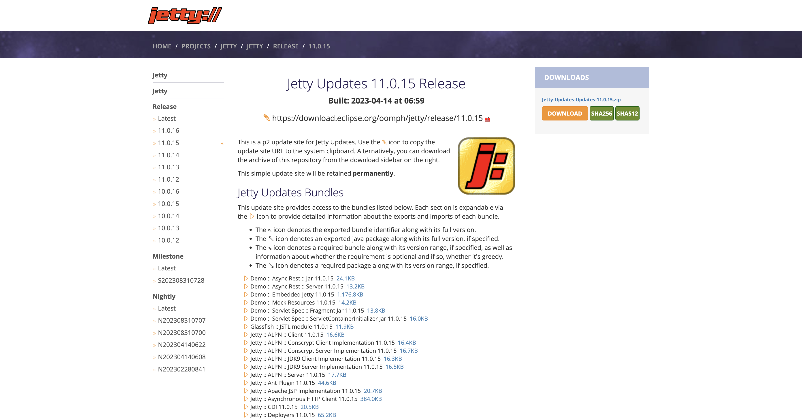

Running Tests
-------------

```bash
mvn clean verify
```

Packaging
---------

```bash
mvn clean package
```

A [**WAR** file](https://en.wikipedia.org/wiki/WAR_(file_format)) named `astraios-1.0-SNAPSHOT.war` will
be generated under _target_ directory for [running in Jetty](#running-in-standalone-jetty)

Running Webservice in Docker (Development)
------------------------------------------

:::caution

Support [running this template webservice in Docker][astraios Dockerfile] is NOT for production deployment.
It's intended usage is for **development** where developer can easily stand up a webservice instance for dev and
testing purpose.

Production deployment for [astraios][astraios] assumes
[Jetty-based scheme](#running-webservice-in-standalone-jetty-production)

:::

### Getting Image

#### Docker Hub

We can pull the image from [its docker hub][docker hub]:

```bash
docker pull jack20191124/astraios
```

#### GitHub

We could also build the image from [source][astraios Dockerfile]:

```bash
https://github.com/paion-data/astraios.git
cd astraios
docker build -t paiondata/astraios
```

:::tip

If we need to pass one or more runtime environment variables into docker image, we can do

```bash
export MY_ENV_VARIABLE=foo
export MY_OTHER_ENV_VARIABLE=bar

docker build -t paiondata/astraios \
  --build-arg MY_ENV_VARIABLE=$MY_ENV_VARIABLE \
  --build-arg MY_OTHER_ENV_VARIABLE=$MY_OTHER_ENV_VARIABLE \
  .
```

where the _Dockerfile_ contains

```dockerfile
ARG MY_ENV_VARIABLE
ARG MY_OTHER_ENV_VARIABLE

ENV MY_ENV_VARIABLE $MY_ENV_VARIABLE
ENV MY_OTHER_ENV_VARIABLE $MY_OTHER_ENV_VARIABLE
```

:::

### Standup a Container

When image is on our machine (either by pulling or building), we can spin up an instance using

```bash
docker run -d --name=astraios -p 8080:8080 paiondata/astraios
```

At this moment, the healthcheck endpoint `GET localhost:8080/v1/data/healthcheck` should return 200 status code
properly.

Running Webservice in Standalone Jetty (Production)
---------------------------------------------------

### Download Jetty

At [download page](https://www.eclipse.org/jetty/download.php), pick up a `.tgz` distribution. Since this template
requires Java 11+, we will use "11.0.15" release as an example:



Put the `tar.gz` file into a location of your choice as the installation path and extract the Jetty binary using

```bash
tar -xzvf jetty-home-11.0.15.tar.gz
```

The extracted directory *jetty-home-11.0.15* is the Jetty distribution. We call this directory **$JETTY_HOME**, which
should not be modified.

### Setting Up Standalone Jetty

Our [WAR file](#packaging) will be dropped to a directory where Jetty can pick up and run. We call this directory
**$JETTY_BASE**, which is usually different from the _$JETTY_HOME_. The _$JETTY_BASE_ also contains container runtime
configs. In short, the Standalone Jetty container will be setup with

```bash
export JETTY_HOME=/path/to/jetty-home-11.0.15
mkdir -p /path/to/jetty-base
cd /path/to/jetty-base
java -jar $JETTY_HOME/start.jar --add-module=annotations,server,http,deploy
```

where `/path/to/` is the _absolute_ path to the directory containing the `jetty-home-11.0.15` directory

The `--add-module=annotations,server,http,deploy` is how we configure the Jetty container.

Lastly, drop the [WAR file](#packaging) into **/path/to/jetty-base/webapps** directory and rename the WAR file to
**ROOT.war**:

```bash
mv /path/to/war-file /path/to/jetty-base/webapps/ROOT.war
```

### Running Jersey Template Webservice

```bash
java -jar $JETTY_HOME/start.jar
```

The webservice will run on port **8080**

[docker hub]: https://hub.docker.com/r/jack20191124/astraios/

[astraios]: https://github.com/paion-data/astraios
[astraios Dockerfile]: https://github.com/paion-data/astraios/blob/master/Dockerfile
