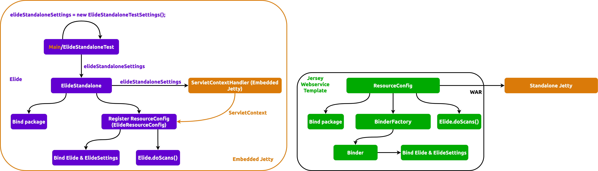

[Astraios] delegates JPA capabilities to [Elide] and configures Elide through 2 required Elide
[bindings][what is binding]:

1. **[Elide][Elide instance class]**
2. **[ElideSettings][ElideSettings instance class]** with 2 extra sub-bindings:

   - **EntityDictionary**
   - **DataStore**

The binding is referencing [Elide Standalone] in the following way:

:::danger

Although the Jersey binder wraps HK2 binder, we
[must pick the _Jersey binder_ for binding Elide resources](https://github.com/paion-data/astraios/pull/10/files#diff-7633fbf494dcb17a51964f179a341b02c328a7214fa3c2c01ba28b1f4cc4dc4aR39-R40),
otherwise, dependency injection will flaky and not right.

:::

[Astraios]: https://paion-data.github.io/astraios/

[Elide]: https://elide.io/
[Elide instance class]: https://github.com/yahoo/elide/blob/master/elide-core/src/main/java/com/yahoo/elide/Elide.java
[Elide Standalone]: https://github.com/yahoo/elide/tree/master/elide-standalone
[ElideSettings instance class]: https://github.com/yahoo/elide/blob/master/elide-core/src/main/java/com/yahoo/elide/ElideSettings.java

[what is binding]: https://qubitpi.github.io/jersey/ioc.html

[Docker Compose]: https://docs.docker.com/compose/
