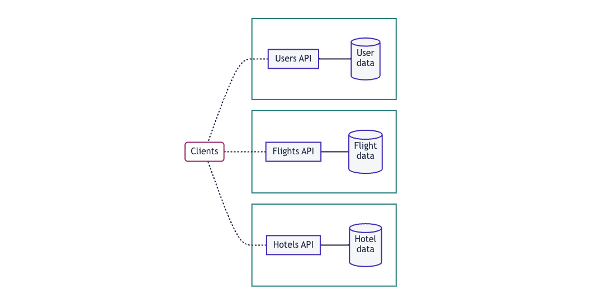

[//]: # (Copyright Paion Data)

[//]: # (Licensed under the Apache License, Version 2.0 &#40;the "License"&#41;;)
[//]: # (you may not use this file except in compliance with the License.)
[//]: # (You may obtain a copy of the License at)

[//]: # (    http://www.apache.org/licenses/LICENSE-2.0)

[//]: # (Unless required by applicable law or agreed to in writing, software)
[//]: # (distributed under the License is distributed on an "AS IS" BASIS,)
[//]: # (WITHOUT WARRANTIES OR CONDITIONS OF ANY KIND, either express or implied.)
[//]: # (See the License for the specific language governing permissions and)
[//]: # (limitations under the License.)

What is GraphQL Federation
--------------------------

GraphQL Federation lets us declaratively combine multiple GraphQL APIs into a single, federated graph. This federated
graph enables clients to interact with multiple APIs through a single request.

A client makes a request to the single entry point of the federated graph called the router. The router intelligently
orchestrates and distributes the request across your APIs and returns a unified response. For a client, the request and
response cycle of querying the router looks the same as querying any GraphQL server.


### Benefits of Federation

#### Microservices Architecture

GraphQL Federation lets API teams operate in a
[microservices architecture](https://www.atlassian.com/microservices/microservices-architecture/microservices-vs-monolith)
while exposing a unified GraphQL API to clients. Understanding these concepts can help us get the most out of
federation.

#### Preserve Client Simplicity and Performance

A client may need to make multiple requests when interacting with multiple non-federated GraphQL APIs. This can happen
when an organization adopting GraphQL has multiple teams developing APIs independently. Each team sets up a GraphQL API
that provides the data used by that team. For example, a travel app may have separate GraphQL APIs for users, flights,
and hotels:



With a single federated graph, we preserve a powerful advantage of GraphQL over traditional REST APIs: the ability to
fetch all the data we need in a single request.


The router intelligently calls all the APIs it needs to complete requests rather than simply forwarding them. For
performance and security reasons, clients should only query the router, and only the router should query the constituent
APIs. No client-side configuration is required.

#### Design Schemas at Scale

Some alternative approaches to combining GraphQL APIs impose limits on our schema, like adding namespaces or
representing relationships with IDs instead of types. With these approaches, our individual GraphQL API schemas may look
unchanged—but the resulting federated schema that clients interact with is more complex. Subsequently, it requires us to
make frontend as well as backend changes.

With GraphQL Federation, clients can interact with the federated schema as if it were a monolith. Consumers of our API
shouldn't know or care that it's implemented as microservices.

GraphQL Federation in Elide
---------------------------

Elide supports GraphQL Federation. This feature needs to be enabled to be used.

### Enabling GraphQL Federation

TBA

### Schema Introspection Queries

When GraphQL Federation is enabled, Elide will respond to enhanced introspection queries with `Query._service` with the
GraphQL schemas generated by Elide.

```graphql
query {
  _service {
    sdl
  }
}
```

Elide does not have any built in measures to control which clients can execute the introspection queries. These queries
should typically be restricted only to the federated graph routers.

### Implementing Federated Graphs

Elide generates its GraphQL schema programatically and cannot be used to define federated entities. This will need to
be done in another subgraph implementation using a different subgraph library

#### Extending an Elide entity

The Elide entity can be extended with additional entities from the subgraph using the `@extends` directive. The
configurations are done in the subgraph and not in Elide.

In the following example the `Group` entity from Elide is being extended to provide the additional `GroupReview` entity
provided by the subgraph.

```graphql
type Group @key(fields: "name") @extends {
    name: DeferredID! @external
    groupReviews: [GroupReview!]!
}
```

Note that Elide uses a custom scalar `DeferredID` instead of `ID` which will need to be registered with the subgraph.

The following query is an example that starts from the `Group` entity on Elide and references the `GroupReview` entity
on the subgraph.

```graphql
query {
  group {
    edges {
      node {
        commonName
        groupReviews {
          stars
          text
        }
      }
    }
  }
}
```

After the router queries the `Group` entity on Elide, it will also make another query to this subgraph to get the
`GroupReview` entity.

The router will use the following query on the subgraph to add the additional fields of `GroupReview` to the `Group`
entity.

```graphql
query {
  _entities(representations: [{__typename: "Group", name: "com.yahoo.elide"}]) {
    ... on Group {
      stars
      text
    }
  }
}
```

#### Including Elide entities

The subgraph entity can include Elide entities as Elide supports the `@key` directive. The following is the schema that
Elide generates for the `Group` entity.

```graphql
type Group @key(fields : "name") {
  commonName: String
  description: String
  name: DeferredID
  products(after: String, data: [ProductInput], filter: String, first: String, ids: [String], op: ElideRelationshipOp = FETCH, sort: String): ProductConnection
}
```

The following is the schema of `GroupReview` on the subgraph.

```graphql
type GroupReview {
    id: ID!,
    text: String
    stars: Int!
    group: Group
}
```

The following query is an example that starts from the `GroupReview` entity on subgraph and references the `Group`
entity on Elide.

```graphql
query {
  groupReviews {
    id
    stars
    text
    group {
      name
      commonName
    }
  }
}
```

After calling to retrieve the `GroupReview` entites on the subgraph, the router calls Elide with the following query.

```graphql
query {
  _entities(representations: [{__typename: "Group", name: "com.yahoo.elide"}]) {
    ... on Group {
      name
      commonName
    }
  }
}
```

Elide will determine the projection in `GraphQLEntityProjectionMaker`.

The `EntitiesDataFetcher` will fetch a list of `NodeContainer`.

```java
public class EntitiesDataFetcher implements DataFetcher<List<NodeContainer>> {

    ...
}
```

The `EntityTypeResolver` will map the `NodeContainer` to the appropriate `GraphQLObjectType`.

#### Defining the DeferredID scalar

Elide uses a custom scalar `DeferredID` instead of `ID`. This needs to be registered with the subgraph implementation.
The following is the schema definition.

```graphql
scalar DeferredID
```
