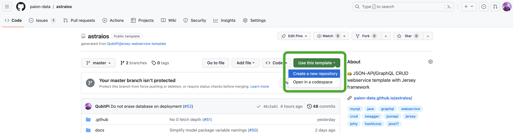
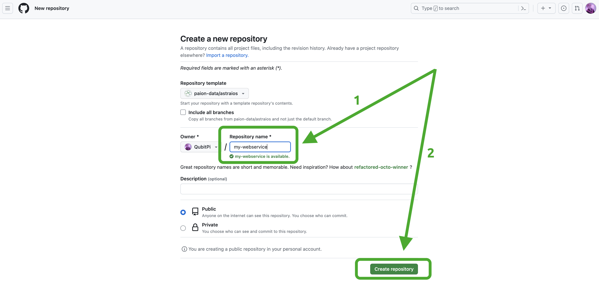

[//]: # (Copyright 2024 Paion Data)

[//]: # (Licensed under the Apache License, Version 2.0 &#40;the "License"&#41;;)
[//]: # (you may not use this file except in compliance with the License.)
[//]: # (You may obtain a copy of the License at)

[//]: # (    http://www.apache.org/licenses/LICENSE-2.0)

[//]: # (Unless required by applicable law or agreed to in writing, software)
[//]: # (distributed under the License is distributed on an "AS IS" BASIS,)
[//]: # (WITHOUT WARRANTIES OR CONDITIONS OF ANY KIND, either express or implied.)
[//]: # (See the License for the specific language governing permissions and)
[//]: # (limitations under the License.)

import Tabs from '@theme/Tabs';
import TabItem from '@theme/TabItem';

:::caution

Before proceeding, it is important to note that **we DO NOT support Spring/Spring Boot paradigm**. [Astraios] runs as a
**[JAX-RS]** webservice backed by its reference implementation [Jersey] running as a WAR inside [Jetty] container.

More info about difference between JAX-RS and Spring can be found in [this thread](https://stackoverflow.com/a/42955575)

:::

So You Want An API?
-------------------

:::info Please make sure JDK 17, Maven, and Docker Engine have been installed 🤗

- We offer [instruction](setup#installing-java--maven-on-mac) on how to install JDK 17 and Maven
- We also offer [links to Docker Engine installation](setup#installing-docker-engine)

:::

Instantiating the Template
--------------------------

Please visit [Astraios GitHub] and either

1. clone the repo with `git clone https://github.com/paion-data/astraios.git`, or
2. make it a template instantiation with our own webservice name by doing the following:

  
  

Creating Models
---------------

Astraios models are some of the most important code in any webservice project. Our models are the view of our data that
we wish to expose. In this example we will be modeling a _book_ since most people have a high-level familiarity with
books in life.

Our _Book_ model looks something like this:

```java
import com.paiondata.elide.annotation.Include;

import jakarta.persistence.Entity;
import jakarta.persistence.GeneratedValue;
import jakarta.persistence.Id;
import jakarta.persistence.Table;

@Entity
@Table(name = "book")
@Include(rootLevel = true, name = "book", description = "book entity", friendlyName = "book")
public class Book {

    @Id
    @GeneratedValue
    public long id;

    public String title = "";
}
```

:::tip

Models are usually packaged as **JAR** file in a separate Maven project. Here is a complete
[example](https://github.com/paion-data/astraios-data-models-example)

:::

In the end, run `mvn clean install` to install our model

:::info

From this point on, we assume [this example data model][astraios-data-models-example] is used

```bash
git clone https://github.com/paion-data/astraios-data-models-example.git
cd astraios-data-models-example.git
mvn clean install
```

:::

Loading Data Models
-------------------

So now we have some models, but without an API it is not very useful. Now we need to instruct our _my-webservice_ to
load [data models](#creating-models) via Maven config file, i.e. **~/.m2/settings.xml**:

```xml
<settings xmlns="http://maven.apache.org/SETTINGS/1.0.0"
          xmlns:xsi="http://www.w3.org/2001/XMLSchema-instance"
          xsi:schemaLocation="http://maven.apache.org/SETTINGS/1.0.0
                      http://maven.apache.org/xsd/settings-1.0.0.xsd">

    <profiles>
        <profile>
            <id>astraios-data-models</id>
            <properties>
                <model.package.jar.group.id>com.paiondata</model.package.jar.group.id>
                <model.package.jar.artifact.id>astraios-data-models-example</model.package.jar.artifact.id>
                <model.package.jar.version>1.0.0</model.package.jar.version>
            </properties>
        </profile>
    </profiles>

    <activeProfiles>
        <activeProfile>astraios-data-models</activeProfile>
    </activeProfiles>
</settings>
```

Running
-------

With data models defined, can run _my-webservice_

```bash
cd my-webservice
mvn clean package
MODEL_PACKAGE_NAME=com.paiondata.astraios.data.models docker compose up --build --force-recreate
```

:::info

`com.paiondata.astraios.data.models` is the name of the model in the aforementioned
[data model project][astraios-data-models-example]

:::

Writing Data
------------

### Inserting Data

We have defined our views on the database and exposed those views over HTTP. Next let's use cURL to put data in the
database.

<Tabs>
  <TabItem value="jsonapi" label="JSON-API" default>
    ```bash
    curl -X POST http://localhost:8080/v1/data/book \
        -H "Content-Type: application/vnd.api+json" \
        -H "Accept: application/vnd.api+json" \
        -d '{"data": {"type": "book", "attributes": { "title": "Pride and Prejudice" }}}'
    ```
  </TabItem>
  <TabItem value="graphql" label="GraphQL">
    ```bash
    curl -X POST "http://localhost:8080/v1/data" \
        -H "Content-Type: application/json" \
        -H "Accept: application/json"  \
        -d '{ "query" : "mutation { book(op: UPSERT, data:{title: \"Pride & Prejudice\"}) { edges { node { id title } } } }" }'
    ```
  </TabItem>
  <TabItem value="graphql-query" label="(GraphQL) Query">
    ```graphql
    mutation {
      book(op: UPSERT, data:{title: "Pride & Prejudice"}) {
        edges {
          node {
            id
            title
          }
        }
      }
    }
    ```
  </TabItem>
</Tabs>

When we run that cURL call we should see a bunch of JSON returned, that is our newly inserted object!

<Tabs>
  <TabItem value="jsonapi" label="JSON-API" default>
    ```json
    {
       "data":{
          "type":"book",
          "id":"1",
          "attributes":{
             "title":"Pride and Prejudice"
          }
       }
    }
    ```
  </TabItem>
  <TabItem value="graphql" label="GraphQL">
    ```json
    {
       "data":{
          "book":{
             "edges":[
                {
                   "node":{
                      "id":"4",
                      "title":"Pride & Prejudice"
                   }
                }
             ]
          }
       }
    }
    ```
  </TabItem>
</Tabs>

### Looking at Our Data

<Tabs>
  <TabItem value="browser" label="Web Browser" default>
    <!-- markdown-link-check-disable -->
    Simply open up our favorite browser and hit **http://localhost:8080/v1/data/book**
    <!-- markdown-link-check-enable -->

:::tip

It is recommended to view result with some
[JSON formatter](https://chromewebstore.google.com/detail/json-formatter/bcjindcccaagfpapjjmafapmmgkkhgoa) browser
extension for better viewing experience

:::

  </TabItem>
  <TabItem value="json-api" label="JSON-API">
    ```bash
    curl "http://localhost:8080/v1/data/book"
    ```
  </TabItem>
  <TabItem value="graphql" label="GraphQL">
    ```bash
    curl -X POST "http://localhost:8080/v1/data" \
        -H "Content-Type: application/json" \
        -H "Accept: application/json"  \
        -d '{ "query" : "{ book { edges { node { id title } } } }" }'
    ```
  </TabItem>
  <TabItem value="graphql-query" label="(GraphQL) Query">
    ```graphql
    {
      book {
        edges {
          node {
            id
            title
          }
        }
      }
    }
    ```
  </TabItem>
</Tabs>

### Modifying Data

Notice that, when we created it, we did not set any of the attributes of our new book record. Updating our data to help
our users is just as easy as it is to add new data. Let's update our model with the following cURL call.

<Tabs>
  <TabItem value="jsonapi" label="JSON-API" default>
    ```bash
    curl -X PATCH http://localhost:8080/v1/data/book/1 \
        -H "Content-Type: application/vnd.api+json" \
        -H "Accept: application/vnd.api+json" \
        -d '{"data": {"type": "book", "id": "1", "attributes": { "title": "Emma" }}}'
    ```
  </TabItem>
  <TabItem value="graphql" label="GraphQL">
    ```bash
    curl -X POST "http://localhost:8080/v1/data" \
        -H "Content-Type: application/json" \
        -H "Accept: application/json"  \
        -d '{ "query" : "mutation { book(op: UPSERT, data: {id: \"1\", title: \"Emma\"}) { edges { node { id title } } } }" }'
    ```
  </TabItem>
  <TabItem value="graphql-query" label="(GraphQL) Query">
    ```graphql
    mutation {
      book(op: UPSERT, data: {id: "1", title: "Emma"}) {
        edges {
          node {
            id
            title
          }
        }
      }
    }
    ```
  </TabItem>
</Tabs>

[Astraios]: https://astraios.io/
[Astraios GitHub]: https://github.com/paion-data/astraios

[JAX-RS]: https://jcp.org/en/jsr/detail?id=370
[Jersey]: https://eclipse-ee4j.github.io/jersey.github.io/documentation/latest/index.html
[astraios-data-models-example]: https://github.com/paion-data/astraios-data-models-example
[Jetty]: https://eclipse.dev/jetty/
