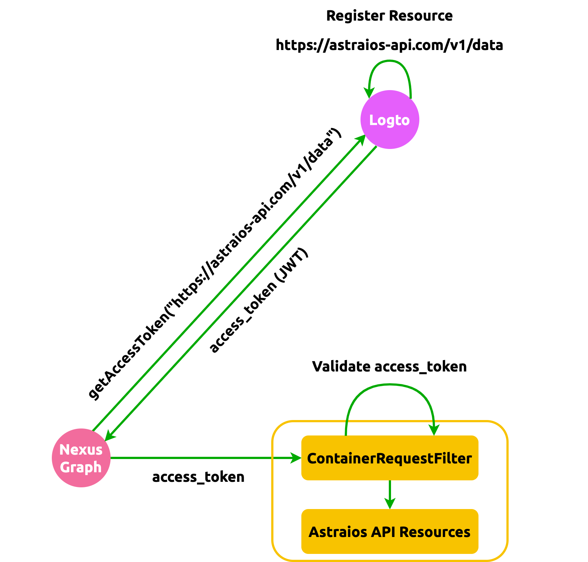

Core Concepts
-------------

API authentication is largely a solved problem and generally outside the scope of Astraios.
Authorization - the act of verifying data and operation access for an _already authenticated user_ in the Astraios
gets delegated to Elide.

Astraios does, however, adds a layer of security on its own by validating [OAuth 2 access token] on all incoming
request. Each Astraios API request requires a standard **"Authentication": "Bearer <access_token>"** token header:

:::info

The validator is working exclusively for ES384 JWT token and can be turned on by setting **OAUTH_ENABLED** to _true_.
There are 3 ways to do so (with the priority in the following order):

1. Putting an **oauth.properties** file under _src/main/resources_ directory with the following content

   ```properties
   OAUTH_ENABLED=true
   ```

2. Setting an OS environment variable using, for example, `export OAUTH_ENABLED=true`
3. Define a JVM system property by

   ```java
   System.setProperty("OAUTH_ENABLED", "true");
   ```

In addition, JWKs URL needs to be set with **JWKS_URL** using the same approach above. The URL should display something
like the following

```json
{
    "keys": [
        {
            "kty": "EC",
            "use": "sig",
            "kid": "eTERknhur9q8gisdaf_dfrqrgdfsg",
            "alg": "ES384",
            "crv": "P-384",
            "x": "sdfrgHGYF...",
            "y": "sdfuUIG&8..."
        }
    ]
}
```

:::



[OAuth 2 access token]: https://www.oauth.com/oauth2-servers/access-tokens/
