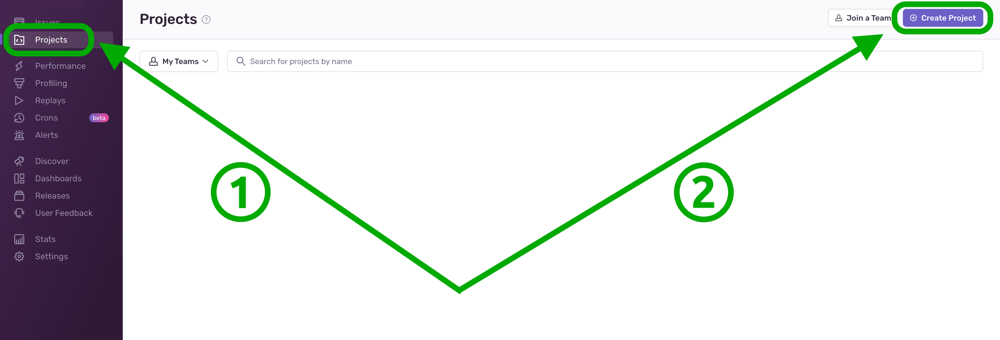
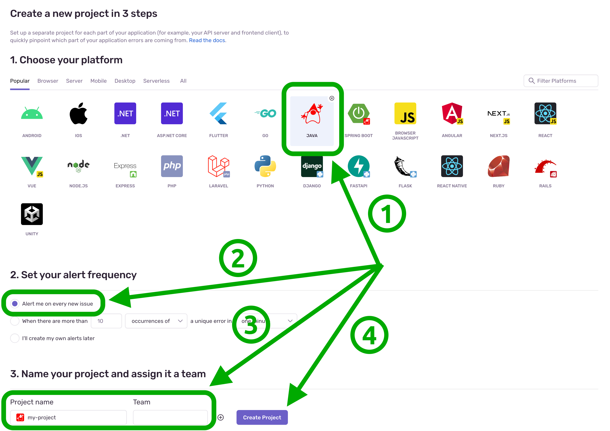
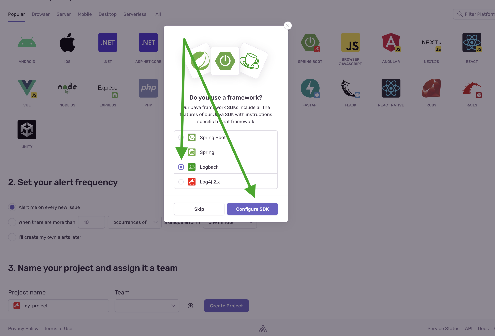

Sentry is a developer-first error tracking and performance monitoring platform that helps developers see what actually
matters, solve quicker, and learn continuously about their applications.

  
  
  
  

:::note

The logging framework has to be <b>Logback</b>, which is the logging library used in
[jersey-ws-template][jersey-ws-template]

:::

### Hiding [Sentry DSN](https://docs.sentry.io/platforms/java/guides/logback/#dsn-configuration)

It is recommended to simply define **SENTRY_DSN** environment variable via CI/CD so that Sentry SDK can pick it up
automatically

[jersey-ws-template]: https://github.com/QubitPi/jersey-ws-template

[Sentry DSN]: https://docs.sentry.io/platforms/java/guides/logback/#dsn-configuration
