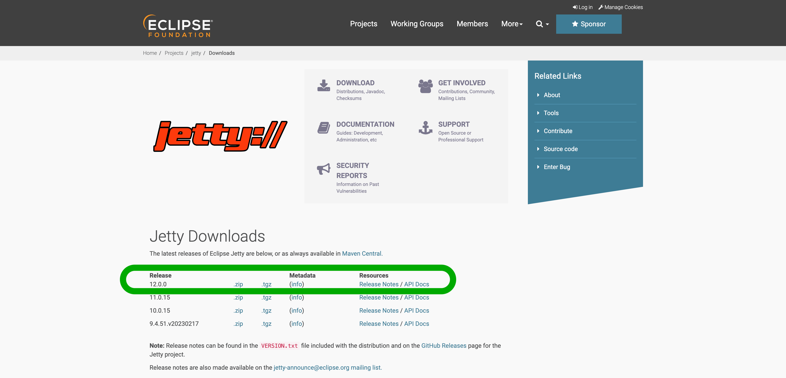

[//]: # (Copyright Paion Data)

[//]: # (Licensed under the Apache License, Version 2.0 &#40;the "License"&#41;;)
[//]: # (you may not use this file except in compliance with the License.)
[//]: # (You may obtain a copy of the License at)

[//]: # (    http://www.apache.org/licenses/LICENSE-2.0)

[//]: # (Unless required by applicable law or agreed to in writing, software)
[//]: # (distributed under the License is distributed on an "AS IS" BASIS,)
[//]: # (WITHOUT WARRANTIES OR CONDITIONS OF ANY KIND, either express or implied.)
[//]: # (See the License for the specific language governing permissions and)
[//]: # (limitations under the License.)

运行测试
-------

以下命令运行单元测试和集成测试：

```bash
mvn clean verify
```

对于IT测试，我们使用 [Testcontainers] 而不是 [jcabi-mysql]，因为后者很难配置和调试，并且 [Testcontainers] 支持更多类型的数据库，例如
mongo

打包
----

```bash
mvn clean package
```

在 target 目录下会生成一个名为 astraios-1.0-SNAPSHOT.war 的 [WAR 文件](https://en.wikipedia.org/wiki/WAR_(file_format))，
以便[在 Jetty 中运行](#running-in-standalone-jetty)

在 Standalone Jetty 中运行 Webservice (生产环境)
-------------------------------------------

### 下载 Jetty

在[下载页面](https://www.eclipse.org/jetty/download.php)，选择一个 `.tgz` 发行版。**选择与 JDK 版本匹配的 Jetty 服务器版本非常重要**。对于 JDK **17**，经测试
Jetty _11.0.15_ 可以工作。

因此，我们将使用“11.0.15”版本作为示例：



将 `tar.gz` 文件放入您选择的安装路径的位置，并使用以下命令提取 Jetty 二进制文件

```bash
tar -xzvf jetty-home-11.0.15.tar.gz
```

提取的目录名称 *jetty-home-11.0.15* 是Jetty发行版。我们将此目录称为 **$JETTY_HOME**，不应对其进行修改。

### 设置 Standalone Jetty

我们的 [WAR 文件](#packaging) 将被放置到 Jetty 可以拾取并运行的目录中。我们将此目录称为 **$JETTY_BASE**，它通常与 _$JETTY_HOME_
不同。_$JETTY_BASE_ 还包含容器运行时的配置。简而言之，Standalone Jetty 容器将设置为：

```bash
export JETTY_HOME=/path/to/jetty-home-11.0.15
mkdir -p /path/to/jetty-base
cd /path/to/jetty-base
java -jar $JETTY_HOME/start.jar --add-module=annotations,server,http,deploy,servlet,webapp,resources,jsp,websocket
```

其中 `/path/to/` 是包含 `jetty-home-11.0.15` 文件夹的目录的绝对路径

`--add-module=annotations,server,http,deploy,servlet,webapp,resources,jsp,websocket` 就是我们配置 Jetty 容器的方式。

最后，将 [WAR 文件](#packaging) 放入 **/path/to/jetty-base/webapps** 目录并将 WAR 文件重命名为 **ROOT.war**：

```bash
mv /path/to/war-file /path/to/jetty-base/webapps/ROOT.war
```

### 运行 Webservice

```bash
java -jar $JETTY_HOME/start.jar
```

Webservice 将在 **8080** 端口上运行，您将看到您插入的数据

[Docker Compose]: https://docs.docker.com/compose/

[jcabi-mysql]: https://mysql.jcabi.com/

[Testcontainers]: https://qubitpi.github.io/testcontainers-java/
