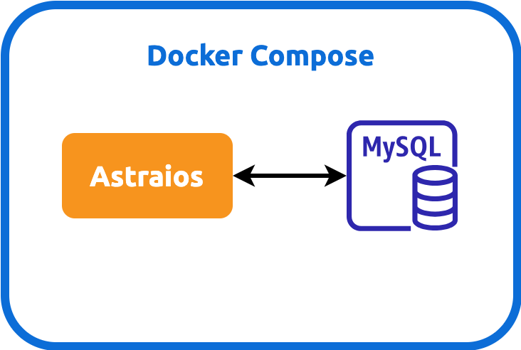

[Astraios] 将 JPA 功能代理给 [Elide]。JWT 通过 2 个必需的 [bindings][what is binding] 来配置 Elide：

1. **[Elide][Elide instance class]**
2. **[ElideSettings][ElideSettings instance class]** 必须有两个额外的 sub-bindings:

    - **EntityDictionary**
    - **DataStore**

binding 通过以下方式引用 [Elide Standalone]：

:::danger

虽然 Jersey Binder 封装了 HK2 Binder，但我们必须选择
[Jersey Binder 来绑定 Elide 资源](https://github.com/paion-data/astraios/pull/10/files#diff-7633fbf494dcb17a51964f179a341b02c328a7214fa3c2c01ba28b1f4cc4dc4aR39-R40)，
否则依赖注入会不稳定并且报错。

:::


使用 Docker Compose 运行 Webservice
----------------------------------

### 第一步：定义数据模型

要注入 [Elide 模型包](https://github.com/yahoo/elide/tree/master/elide-standalone#create-models)，只需将模型放入单独的 JAR 中，
并将其作为依赖项包含在 POM 中。如果模型包是内部的并且无法公开可见，请使用环境变量掩码将 Webservice 项目设为私有或公开，例如：

```xml
    <dependencies>
    <dependency>
        <groupId>${env.MODEL_PACKAGE_JAR_GROUP_ID}</groupId>
        <artifactId>${env.MODEL_PACKAGE_JAR_ARTIFACT_ID}</artifactId>
        <version>${env.MODEL_PACKAGE_JAR_VERSION}</version>
    </dependency>
</dependencies>

        ...

<repositories>
<repository>
    <id>${env.MODEL_PACKAGE_REPO_ID}</id>
    <name>JPA model pacakge JAR repository</name>
    <url>${env.MODEL_PACKAGE_REPO_URL}</url>
</repository>
</repositories>
```

```bash
export MODEL_PACKAGE_JAR_GROUP_ID=com.mycompnay
export MODEL_PACKAGE_JAR_ARTIFACT_ID=my-model-package
export MODEL_PACKAGE_JAR_VERSION=1.0.7

export MODEL_PACKAGE_REPO_ID=my-repo-id
export MODEL_PACKAGE_REPO_URL=https://private.mvnrepository.com/artifact/com.company/my-model-package
```

### 第二步：启动 Docker Compose

Astraios 可以在[Docker Compose]中运行，并达到以下作用

1. 解耦前端和后端开发
2. 轻松在 CI/CD 中运行 Astraios 所支持的应用程序的 E2E 测试

:::caution

这里设计的 Docker Compose 仅用于本地开发和测试！_强烈建议不要在生产环境中运行此 Docker Compose！_

:::



只需运行以下指令:

```bash
git clone git@github.com:paion-data/astraios.git
cd astraios
mvn clean package
MODEL_PACKAGE_NAME=$ASTRAIOS_MODEL_PACKAGE_NAME docker compose up --build --force-recreate
```

其中 `$ASTRAIOS_MODEL_PACKAGE_NAME` 包是用来配置 JAR 中包含的所有
[elide models](https://elide.io/pages/guide/v7/02-data-model.html)，它是可以设置的。
例如，可以在命令行中使用以下命令进行设置：

```bash
export $ASTRAIOS_MODEL_PACKAGE_NAME=com.mycompany.jwt.models
```

该变量将被[传递](https://stackoverflow.com/a/58900415)到 Docker Compose 文件中。

### 故障排除

#### 数据库中没有我的模型包的 Bean 表

如果测试在 IntelliJ IDE 中运行，请确保模型包 JAR 位于 IDE 的**外部库**中。

否则，依赖注入无法在 [$ASTRAIOS_MODEL_PACKAGE_NAME](#第一步：定义数据模型) 指定的包下找到 bean 类

### 实体缺少默认的构造函数

```bash
[main] INFO  o.h.m.i.EntityInstantiatorPojoStandard - HHH000182: No default (no-argument) constructor for
class: ... (class must be instantiated by Interceptor)
```

只需在 bean 类中添加一个无参数的构造函数即可。

### 如何排除GraphQL特性

要选择禁用 GraphQL 端点，请排除 POM 中的相应依赖项。例如：

```xml
        <dependency>
            <groupId>com.yahoo.elide</groupId>
            <artifactId>elide-core</artifactId>
            <version>7.0.0-pr6</version>
            <exclusions>
                <exclusion>
                    <groupId>com.yahoo.elide</groupId>
                    <artifactId>elide-graphql</artifactId>
                </exclusion>
            </exclusions>
        </dependency>
```

[Astraios]: https://paion-data.github.io/astraios/

[Elide]: https://elide.io/
[Elide instance class]: https://github.com/yahoo/elide/blob/master/elide-core/src/main/java/com/yahoo/elide/Elide.java
[Elide Standalone]: https://github.com/yahoo/elide/tree/master/elide-standalone
[ElideSettings instance class]: https://github.com/yahoo/elide/blob/master/elide-core/src/main/java/com/yahoo/elide/ElideSettings.java

[what is binding]: https://qubitpi.github.io/jersey/ioc.html
