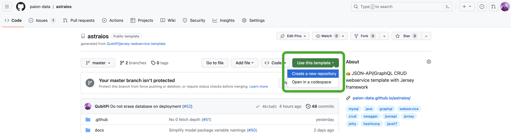
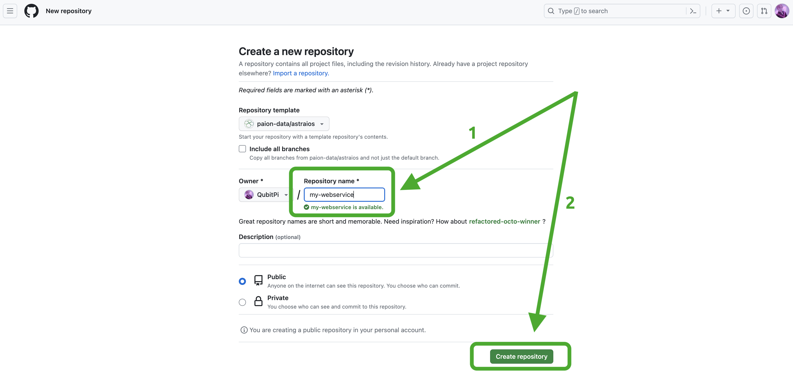

[//]: # (Copyright Paion Data)

[//]: # (Licensed under the Apache License, Version 2.0 &#40;the "License"&#41;;)
[//]: # (you may not use this file except in compliance with the License.)
[//]: # (You may obtain a copy of the License at)

[//]: # (    http://www.apache.org/licenses/LICENSE-2.0)

[//]: # (Unless required by applicable law or agreed to in writing, software)
[//]: # (distributed under the License is distributed on an "AS IS" BASIS,)
[//]: # (WITHOUT WARRANTIES OR CONDITIONS OF ANY KIND, either express or implied.)
[//]: # (See the License for the specific language governing permissions and)
[//]: # (limitations under the License.)

import Tabs from '@theme/Tabs';
import TabItem from '@theme/TabItem';

:::caution

开始之前，我们需要声明的是，我们不支持 Spring/Spring Boot 框架，[Astraios] 是一个严格遵照 **[JAX-RS]** 标准运行的 web
服务，背后采用官方指定 [Jersey] 框架实现，并以 WAR 的形式运行于 [Jetty] 容器服务中。

了解更多关于 JAX-RS 和 Spring 区别，请详阅[这篇帖子](https://stackoverflow.com/a/42955575)

:::

需要搭建一个 API ？
----------------

:::info 请确保已经安装 JDK 17, Maven, 和 Docker Engine 🤗

- 我们提供如何安装 JDK 17 和 Maven 的[教程](setup#installing-java--maven-on-mac)
- 我们也提供[安装 Docker Engine 的链接](setup#installing-docker-engine)

:::

将仓库模版实例化
--------------

请访问[Astraios GitHub]，然后执行以下操作之一：

1. 使用 `git clone https://github.com/paion-data/astraios.git` 克隆代码仓库，或者
2. 用我们自己的 Web 服务名称执行以下操作来将模版实例化：

  
  

创建数据模型
----------

Astraios 模型是一个 Web 服务项目中最重要的代码之一。此模型是我们希望公开的数据视图。
在这个例子中，我们将对 _book_ 进行建模，因为大多数人对生活中的书比较熟悉。

我们的 _Book_ 模型大致如下：

```java
import com.paiondata.elide.annotation.Include;

import jakarta.persistence.Entity;
import jakarta.persistence.GeneratedValue;
import jakarta.persistence.Id;
import jakarta.persistence.Table;

@Entity
@Table(name = "book")
@Include(rootLevel = true, name = "book", description = "book entity", friendlyName = "book")
public class Book {

    @Id
    @GeneratedValue
    public long id;

    public String title = "";
}
```

:::tip

模型通常打包为一个单独 Maven 项目中的 **JAR** 文件。以下是一个
完整的[示例](https://github.com/paion-data/astraios-data-models-example)

:::

最后，运行 `mvn clean install` 来安装模型

:::info

在这之后，我们使用[这个示例数据模型][astraios-data-models-example]

```bash
git clone https://github.com/paion-data/astraios-data-models-example.git
cd astraios-data-models-example.git
mvn clean install
```

:::

加载数据模型
----------

现在我们有了一些模型，但是如果没有 API 的话并不是很有用。
需要让 _my-webservice_ 通过 Maven 配置文件来
加载[数据模型](#creating-models)，即 **~/.m2/settings.xml**：

```xml
<settings xmlns="http://maven.apache.org/SETTINGS/1.0.0"
          xmlns:xsi="http://www.w3.org/2001/XMLSchema-instance"
          xsi:schemaLocation="http://maven.apache.org/SETTINGS/1.0.0
                      http://maven.apache.org/xsd/settings-1.0.0.xsd">

    <profiles>
        <profile>
            <id>astraios-data-models</id>
            <properties>
                <model.package.jar.group.id>com.paiondata</model.package.jar.group.id>
                <model.package.jar.artifact.id>astraios-data-models-example</model.package.jar.artifact.id>
                <model.package.jar.version>1.0.0</model.package.jar.version>
            </properties>
        </profile>
    </profiles>

    <activeProfiles>
        <activeProfile>astraios-data-models</activeProfile>
    </activeProfiles>
</settings>
```

运行
----

有了定义的数据模型之后，我们可以运行 _my-webservice_

```bash
cd my-webservice
mvn clean package
MODEL_PACKAGE_NAME=com.paiondata.astraios.data.models docker compose up --build --force-recreate
```

:::info

`com.paiondata.astraios.data.models` 是之前提到的[数据模型包][astraios-data-models-example]名称

:::

写入数据
--------

### 插入数据

我们已经定义了数据库视图并通过 HTTP 公开了这些视图。我们接下来可以使用 cURL 将数据放入数据库。

<Tabs>
  <TabItem value="jsonapi" label="JSON-API" default>
    ```bash
    curl -X POST http://localhost:8080/v1/data/book \
        -H "Content-Type: application/vnd.api+json" \
        -H "Accept: application/vnd.api+json" \
        -d '{"data": {"type": "book", "attributes": { "title": "Pride and Prejudice" }}}'
    ```
  </TabItem>
  <TabItem value="graphql" label="GraphQL">
    ```bash
    curl -X POST "http://localhost:8080/v1/data" \
        -H "Content-Type: application/json" \
        -H "Accept: application/json"  \
        -d '{ "query" : "mutation { book(op: UPSERT, data:{title: \"Pride & Prejudice\"}) { edges { node { id title } } } }" }'
    ```
  </TabItem>
  <TabItem value="graphql-query" label="(GraphQL) Query">
    ```graphql
    mutation {
      book(op: UPSERT, data:{title: "Pride & Prejudice"}) {
        edges {
          node {
            id
            title
          }
        }
      }
    }
    ```
  </TabItem>
</Tabs>

当我们运行这个 cURL 调用时，应该会看到返回很多 JSON，这就是我们新创建的数据对象！

<Tabs>
  <TabItem value="jsonapi" label="JSON-API" default>
    ```json
    {
       "data":{
          "type":"book",
          "id":"1",
          "attributes":{
             "title":"Pride and Prejudice"
          }
       }
    }
    ```
  </TabItem>
  <TabItem value="graphql" label="GraphQL">
    ```json
    {
       "data":{
          "book":{
             "edges":[
                {
                   "node":{
                      "id":"4",
                      "title":"Pride & Prejudice"
                   }
                }
             ]
          }
       }
    }
    ```
  </TabItem>
</Tabs>

### 查看我们的数据

<Tabs>
  <TabItem value="browser" label="Web Browser" default>
    <!-- markdown-link-check-disable -->
    只需打开任意浏览器并访问 **http://localhost:8080/v1/data/book**
    <!-- markdown-link-check-enable -->

:::tip

建议使用一些[JSON格式化](https://chromewebstore.google.com/detail/json-formatter/bcjindcccaagfpapjjmafapmmgkkhgoa)浏览器
扩展来查看结果，数据内容更加易读

:::

  </TabItem>
  <TabItem value="json-api" label="JSON-API">
    ```bash
    curl "http://localhost:8080/v1/data/book"
    ```
  </TabItem>
  <TabItem value="graphql" label="GraphQL">
    ```bash
    curl -X POST "http://localhost:8080/v1/data" \
        -H "Content-Type: application/json" \
        -H "Accept: application/json"  \
        -d '{ "query" : "{ book { edges { node { id title } } } }" }'
    ```
  </TabItem>
  <TabItem value="graphql-query" label="(GraphQL) Query">
    ```graphql
    {
      book {
        edges {
          node {
            id
            title
          }
        }
      }
    }
    ```
  </TabItem>
</Tabs>

### 更新数据

请注意，我们创建它时并没有设置新书记录的任何属性。用户更新数据和添加新数据一样简单。
使用以下 cURL 调用更新我们的数据。

<Tabs>
  <TabItem value="jsonapi" label="JSON-API" default>
    ```bash
    curl -X PATCH http://localhost:8080/v1/data/book/1 \
        -H "Content-Type: application/vnd.api+json" \
        -H "Accept: application/vnd.api+json" \
        -d '{"data": {"type": "book", "id": "1", "attributes": { "title": "Emma" }}}'
    ```
  </TabItem>
  <TabItem value="graphql" label="GraphQL">
    ```bash
    curl -X POST "http://localhost:8080/v1/data" \
        -H "Content-Type: application/json" \
        -H "Accept: application/json"  \
        -d '{ "query" : "mutation { book(op: UPSERT, data: {id: \"1\", title: \"Emma\"}) { edges { node { id title } } } }" }'
    ```
  </TabItem>
  <TabItem value="graphql-query" label="(GraphQL) Query">
    ```graphql
    mutation {
      book(op: UPSERT, data: {id: "1", title: "Emma"}) {
        edges {
          node {
            id
            title
          }
        }
      }
    }
    ```
  </TabItem>
</Tabs>

[Astraios]: https://astraios.io/
[Astraios GitHub]: https://github.com/paion-data/astraios

[JAX-RS]: https://jcp.org/en/jsr/detail?id=370
[Jersey]: https://eclipse-ee4j.github.io/jersey.github.io/documentation/latest/index.html
[astraios-data-models-example]: https://github.com/paion-data/astraios-data-models-example
[Jetty]: https://eclipse.dev/jetty/
